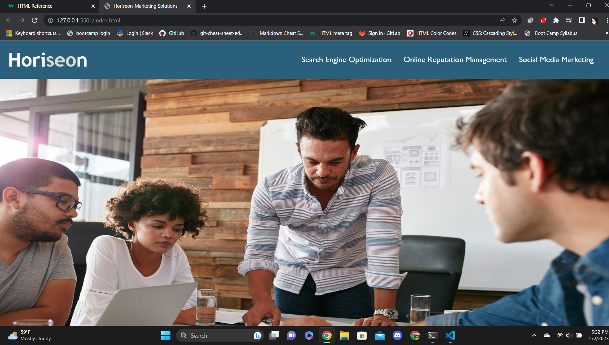

# challenge_1_website_rework

## Description

Provide a short description explaining the what, why, and how of your project. Use the following questions as a guide:

- What was your motivation?
- Why did you build this project? (Note: the answer is not "Because it was a homework assignment.")
- What problem does it solve?
- What did you learn?

The purpose of this project was to refractor a website to make it more accessible and clean-up the css file to be more concise.

I accomplished this task by first changing all 
 tags to proper HTML semantic tags in order to condense the many class tags in the css file into simpler element tags instead. 

Next, I added in the alt text to all images to make them more accessible for those that use screen readers. A problem I came across while doing was the big center image of the people holding a meeting was not listed as an  and instead was a 
 with a class tag that provided background-image. I could not figure how to add alt text to it as-is and referring to google lead me to a solution that was more advanced that what we have learnt. I instead decided to make it an  and assign it a different class tag of .meeting and removed the bit of code that had it listed as background-image.

I also fixed the broken link at the top of the page (now listed in my <nav> section), but assigning it an id tag, as the other two links had id tags assigned to them in the HTML that made them work.

Something I learnt while doing this project is that element tags can be combined to add more weight to them in order to accomplish the same feat as assign a class or id tag to them. In that regard I left my <main> and <section> areas with dual elements in order to apply the styling to them without needing to assign those as classes in the HTML file.

## Installation

N/A

## Usage
   
    

## Credits

Used W3 Schools HTML Element Reference list to get ideas for new elements and used <aside> for my project.
https://www.w3schools.com/tags/default.asp

## License

N/A
